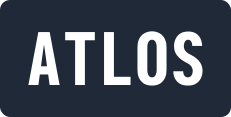

  
   

  

    The open source platform for visual investigations
     
  

  
<a href="https://atlos.notion.site/Platform-Overview-46d4723f22ef420fb5ad0e07feba8d79">Platform Overview</a> &bull; <a href="platform">Code</a>

 

## Motivation

Atlos helps open-source conflict researchers collaborate to preserve the historical record. Today, researchers locate, verify, and catalog media in private databases, on Twitter, and in several different Discord servers. This means that the same arduous geolocation process might happen many times for the same video. Atlos puts everything in one place.

You can learn more about Atlos at https://atlos.org.

## Subprojects

The Atlos platform is in the [`platform/`](platform) subdirectory. The landing page is in the [`landing/`](landing) subdirectory.

## License

Atlos is open source, licensed under the GPLv3. We take the license very seriously.

## Special Thanks

- We are grateful to [AppSignal](https://appsignal.com) for sponsoring our application performance monitoring.
- We are grateful to [Fly.io](https://fly.io) for sponsoring our infrastructure.
- We are grateful to [Logtail](https://betterstack.com/logtail) for sponsoring our logging system.
- We are grateful to [Highlight](https://highlight.io/) for providing invaluable privacy-friendly usage monitoring.

