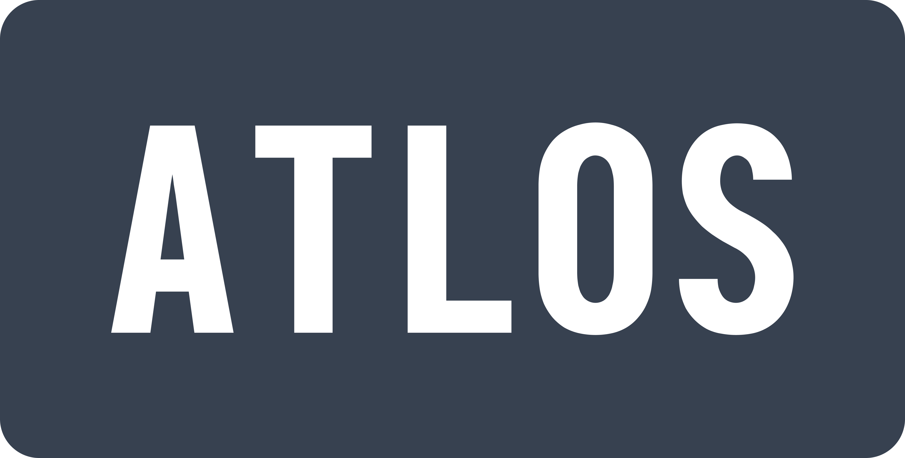

  <picture>
    <source media="(prefers-color-scheme: dark)" srcset="docs/static/Logodark.png">
    
  </picture>
   

  

    The non-profit, open source platform for visual investigations.
     
  

  
<a href="https://atlos.org">atlos.org</a> &bull; <a href="https://docs.atlos.org">Docs</a> &bull; <a href="platform">Code</a>

 

## About

Atlos is a non-profit and open source platform that enables visual investigators to collaborate at scale. Atlos is purpose-built for visual investigations: the platform automatically archives source media, tracks every change to the underlying data, and implements industry-standard researcher safety measures by default. Atlos powers large-scale open source investigations around the world, including Bellingcat's investigation into civilian harm in Ukraine.

Learn more at [atlos.org](https://atlos.org), or read the [docs](https://docs.atlos.org).

## Subprojects

- [`platform/`](platform) — the Atlos platform (Phoenix/Elixir). Technical documentation lives in the subdirectory's README.
- [`landing/`](landing) — the legacy landing page.
- [`docs/`](docs) — the user-facing documentation site at [docs.atlos.org](https://docs.atlos.org).

## License

Atlos is open source, licensed under the GPLv3. We take the license very seriously.

## Special Thanks

- We are grateful to [Microsoft](https://microsoft.com) for sponsoring our cloud infrastructure, as well as providing us with technical support and guidance (and a security audit).
- We are grateful to [AppSignal](https://appsignal.com) for sponsoring our application performance monitoring.
- We are grateful to [Fly.io](https://fly.io) for sponsoring our infrastructure.
- We are grateful to [Logtail](https://betterstack.com/logtail) for sponsoring our logging system.
- We are grateful to [Highlight](https://highlight.io/) for providing invaluable privacy-friendly usage monitoring.

