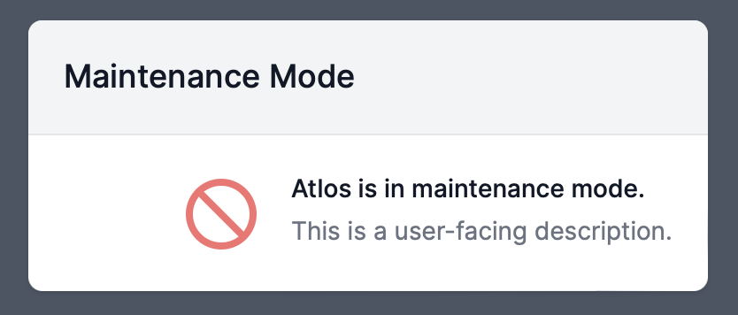

Atlos offers admins several tools for responding to potential security incidents on Atlos. 


**This page explains admin-only features.**
If you don’t administer an instance of Atlos, these features are not relevant to your use of the platform.


## Security modes
Security modes are useful for restricting all users' behavior in the event of 1) platform maintenance, like a new deployment or infrastructure migration, that you expect to take more than a few minutes or 2) a suspected security incident. Atlos has three security modes:
- **Normal—** The default security mode; Atlos doesn't restrict any behavior.
- **Read Only—** All users can access Atlos; only admins can edit incident data.
- **No Access—** Only admins can access Atlos. 

### Change security modes
To change security modes:
1. Navigate to **Adminland**.
2. Click on the **Security** tab.
3. Click **Change Security Mode**.
4. Select the new security mode. 

If you're changing the mode to Read Only or No Access, we recommend writing a brief user-facing message explaining the incident. For example, if you're setting the security mode to No Access until you've completed an infrastructure migration, your message might say "Atlos is undergoing scheduled maintenance and will be back online at 4p PT on Sunday, March 1." Note that Atlos ignores the user-facing message field when transitioning back to the Normal mode.
   

<i>Non-admin users will encounter a message indicating they can't log in when Atlos is in No Access mode.</i>

## Log all users out
In the event of a security incident, you may also want to log out all users. We refer to logging out users as "resetting sessions." To reset all user sessions:
1. Navigate to **Adminland**.
2. Click on the **Security** tab.
3. Click **Reset All Sessions**.