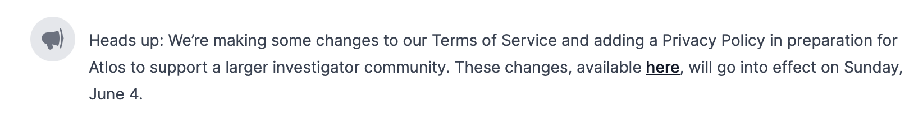

<i>An announcement on the notifications page.</i>

Use announcements to send messages to all users of Atlos. Announcements appear on users' notifications pages.


**This page explains admin-only features.**
If you don’t administer an instance of Atlos, these features are not relevant to your use of the platform.


## Send an announcement
To send an announcement:
1. Navigate to **Adminland**.
2. Click on the **Announcements** tab.
3. Write an announcement and click **Post Announcement**.