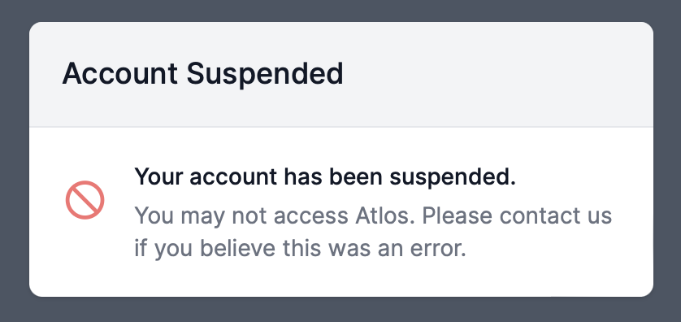

Atlos offers admins several tools for managing users and their activity. 


**This page explains admin-only features.**
If you don’t administer an instance of Atlos, these features are not relevant to your use of the platform.


## View all users on Atlos
To view all users on your instance of Atlos:
1. Navigate to **Adminland**.
2. Click on the **Users** tab.

## Instance-level roles
In addition to roles in projects, Atlos users have a role at the instance-level. These roles are distinct from users' roles in a project. For example, a user who is a viewer in a project but an admin on their instance of Atlos cannot edit incidents in that project but can access Adminland. 

Atlos has three system-level roles:
- **regular—** Regular users have no elevated access or control. All users begin as **regular**; almost all users should always remain **regular**. 
- **trusted—**  When the `RESTRICT_PROJECT_CREATION` environment variable is enabled, only trusted users and admins can create projects. If `RESTRICT_PROJECT_CREATION` is disabled, **trusted** users do not have any additional access or control. 
- **admin—** Admins have heightened access and control; they can take drastic action to lock users out of Atlos and view content in projects of which they're not members. Use extreme caution when making a user an admin.

### Change a user's instance-level role
To change a user's system-level role:
1. Navigate to the user's profile.
2. Click on the **Admin** pane of their profile.
3. Select the appropriate role(s) and click **Save**.

## Suspend users
Just as Atlos doesn't permit destructive edits to incident data, Atlos doesn't permit admins to delete users' accounts. However, it is possible to suspend a user's access to Atlos.

To suspend a user:
1. Navigate to the user's profile.
2. Click on the **Admin** pane of their profile.
3. Under **Restrictions**, select **suspended** and click **Save**.

The suspended user will be logged out of their account the next time they interact with Atlos (i.e., click any button or refresh a page) and will be unable to log back in. They will see the following message:

<i>The message Atlos shows to suspended users.</i>

### Mute users
Note that Atlos allows admins to prevent users from making any edits to any data by muting them through a similar process; this tool is an artifact of previous iterations of the platform. Because incident creation and editing permissions occur on a per-project basis, we recommend using project roles to restrict users' actions. If a user cannot be sufficiently constrained by project roles, we recommend suspending them.

## User groups
Atlos doesn't currently enable admins to group users by organization. However, admins can add flair to users, which can help distinguish users belonging to different organizations. For example, admins might assign staff investigators the `Staff` flair and volunteers the `Volunteer` flair. Flair is visible next to users' usernames.

<i>Use flair to distinguish between different groups of users.</i>

TODO: figure out why this is so big

### Add flair to a user
To add flair to a user: 
1. Navigate to the user's profile.
2. Click on the **Admin** pane of their profile.
3. Under **Flair**, add a short description (we recommend no more than two words) and click **Save**.

## Edit a user's bio
Atlos permits admins to edit users' bios without their permission. We recommend using this tool only in an emergency in which a user is revealing sensitive information in their bio.

To edit a user's bio:
1. Navigate to the user's profile.
2. Click on the **Admin** pane of their profile.
3. Under **Bio**, edit their bio to remove sensitive information and click **Save**.

## Add admin notes
Atlos is not a fully-fledged team management tool; we recommend keeping tabs on your team with external tools. However, Atlos offers limited functionality for admins to keep notes on Atlos users. These admin notes are visible to all admins and are not visible to any other users.

To write or edit an admin note about a user:
1. Navigate to the user's profile.
2. Click on the **Admin** pane of their profile.
3. Under **Admin Notes**, write or edit their Admin Notes and click **Save**.    

## View a user's activity over time
Atlos displays a simple graph of each user's activity over time to help admins understand users' participation in investigations. 

To view a user's activity graph,
1. Navigate to the user's profile.
2. Click on the **Admin** pane of their profile. 

The activity graph shows a user's activity day-to-day; hover over a block to view a user's activity on a specific day. Atlos counts each edit, comment, and creation of an incident as one unit of activity. 

<i>Activity graphs show users' participation over time.</i>

