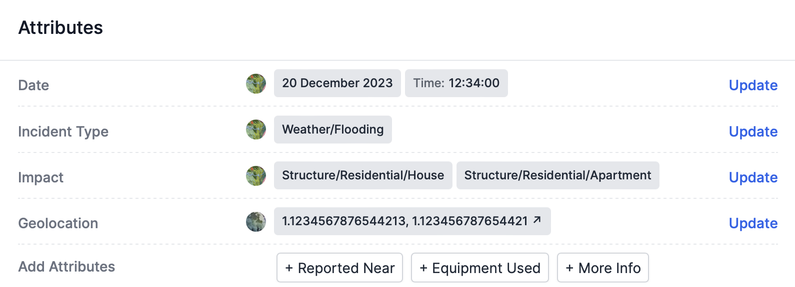

<i>The attribute pane of an incident.</i>

## Attributes describe incidents
Attributes are structured data that describe incidents. Attributes make data easily searchable and provide structure for large-scale tagging or data coding projects. Each attribute corresponds to a single column in a spreadsheet-style investigation. 

## Edit attributes

This section describes how to edit an incident’s data. If you’re looking for a description of data model customization, refer to the section below on [customizing attributes](#customize-attributes). 


To add an attribute that doesn’t yet have a value, click on the attribute’s name in the **Add Attributes** section of the **Attributes** pane.

To update an attribute that already has a value, click **Update** on the right side of the **Attributes** pane. 

After opening the **Update** window:
1. Add or edit the attribute's value(s). 
2. Optionally explain your change in the provided field. We recommend including an explanation for all non-trivial updates.
3. Click **Post update**. You’ll see the update reflected in the **Attributes** pane and in the **Feed**. 

## Core attributes are permanent
Attributes can be customized for each project, but Atlos provides some basic attributes to help investigators get started. Some of these attributes—like Description, Date, Geolocation, and More Info—are core attributes and can’t be removed from a project’s data model. 

## Custom attributes 
Sometimes the default attributes aren’t sufficient. A project might need attributes or values that better describe its incidents or add more detailed context. 

### Components of custom attributes
Custom attributes have four components: 
- **Attribute Name—** The attribute's name. Incident Type, for example.
- **Attribute Type—** This refers to the type of data the attribute will contain:
  - **Text—** Text attributes are free-response text boxes. These can be used for one-word values or for longer content.
  - **Single select—** Use single select attributes for selecting a single option from a list of possible values. Use single-select attributes when values are mutually exlcusive. 
  - **Multiple select—** Use multiple select attributes for cases when you might need to select multiple options at the same time. For example, the default “Impact” attribute is a multi-select attribute; an airstrike can impact many different kinds of buildings simultaneously.
  - **Date—** The date attribute uses a special date attribute type (displayed as DD Month YYYY, or 08 August 2023). To avoid confusion, there can be only one attribute with the date type per incident.
  - **Geolocation—** The Geolocation attribute uses a special location attribute type. There can be only one attribute with the geolocation type attribute per incident. The Geolocation attribute includes two components. The first is a coordinate pair displayed as latitude, longitude. The Geolocation attribute includes a second component which indicates the precision of the location. There are three possible precision values:
    - Exact indicates maximum precision, or ± 10m.
    - Vicinity indicates that the indicated location refers to the same complex, block, or field as the true location, or ± 100m. 
    - Locality indicates that the indicated location refers to the same neighborhood or village as the true location, or ± 1km. 

- **Attribute Description—** An optional description of the attribute. We highly recommend including a detailed description of how you expect investigators to use the attribute to avoid confusion. 
- **Attribute Options—** Attribute options are the potential values for each attribute. Specify each option by typing a value, pressing Enter, and repeating until you’ve listed every option. 

### Customize attributes
To customize a project’s data model: 
1. Navigate to the **Projects** page. 
2. Select the relevant project. 
3. Click on the **Manage** page and scroll down to the **Attributes** pane. 
4. a) To add a new attribute to a project’s data model, click **Add Attribute** on the right side of the **Attributes** pane. 
   
   b) To edit an existing attribute, click the pencil icon to the right of the attribute's name. 
5. Add or edit the attribute's Name, Type, Description, or Options. 
6. Click **Save**.


**Removing attributes during an investigation risks data integrity.**   
If you remove an attribute from your project's data model, that attribute—and its values—will be removed from all incidents in the project.


## Attribute groups
In investigations with many attributes, we recommend creating attribute groups to keep your data model easily understandable for your team.

Attribute groups have several components: 
- **Name**—Use a group's name to describe the group. A location-related attributes might fit into a "Location" group.
- **Description**—A longer text field that provides more context on the group's purpose.
- **Color**—Use a group's color to visually distinguish it from other attribute groups.

### Create an attribute group
To create an attribute group:
1. Navigate to the **Projects** page. 
2. Select the relevant project. 
3. Click on the **Manage** page and scroll down to the **Attributes** pane. 
4. Click **Add Group**.
5. Add a name, description, and color for the group.
6. Click **Save**.

### Add an attribute to an attribute group
To add an existing attribute to a group:
1. Navigate to the **Projects** page. 
2. Select the relevant project. 
3. Click on the **Manage** page and scroll down to the **Attributes** pane. 
4. Drag the attribute from its current location to its new attribute group.

### Exclude attribute groups from incident creation
In investigations with many attributes, you may want to exclude some attribute groups from the new incident form so that investigators can more quickly create incidents. To exclude attribute groups from the form:
1. Navigate to the **Projects** page. 
2. Select the relevant project. 
3. Click on the **Manage** page and scroll down to the **Attributes** pane.
4. On the relevant attribute group, click **Edit Group**.
5. Uncheck the **Include this group in the incident creation window** box. 
6. Click **Save**.