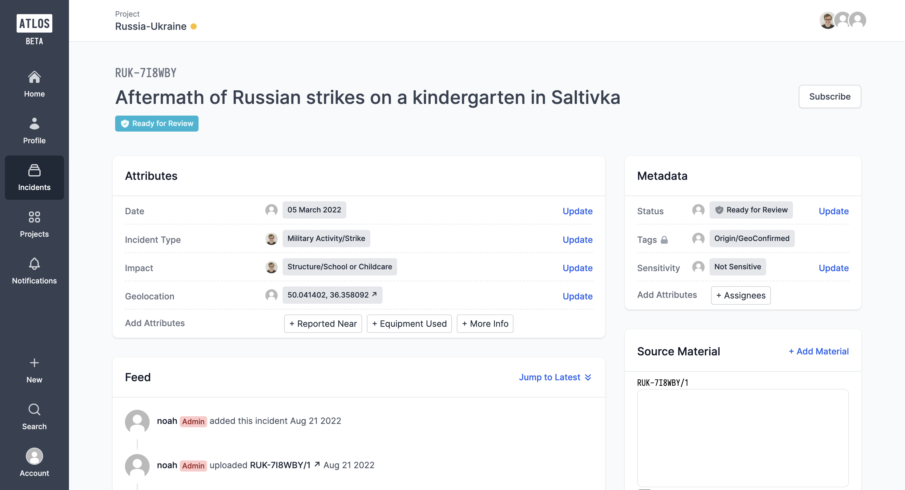

<i>A incident page on Atlos.</i>

## Incidents are the atoms of Atlos 
Incidents are the core unit of content on Atlos. One incident generally corresponds to one event. As you define your data model, consider several factors:
-  **Incidents must have a single location and date—** Incidents on Atlos should be scoped to (or approximated by) a single location and date. This is because of a technical restriction on Atlos; each incident may only have one geolocation and date attribute. 
-  **Incidents can include one or more pieces of source material—** Incidents can be more than just a single source link. Each incident can be supported by an arbitrary number of social media posts, websites, photos, or videos. 
-  **Incidents should be describable in one sentence—** If your incident description is several sentences long, you’re likely trying to capture too many events in a single incident. Try breaking that event down into several components. 

## Incidents have unique IDs
Referring to a complex event can be tedious and confusing. To provide a vocabulary to discuss your data, Atlos generates a unique ID for each incident. 

Each ID consists of two parts: a short project code and a six character incident ID. For example, the ID `CIV-ABC123` refers to an incident within a project whose code is CIV. [Learn more](/investigations/projects/#project-code) about project codes. 

Six character incident IDs are unique and automatically generated by Atlos; no two incidents have the same ID. Project codes are customizable and not unique. It is possible for two investigations on Atlos to share the same project code. 

## Components of incidents
Each incident has a dedicated page with four main components:
- **Attributes—** Attributes are structured data that describe an incident. Geolocation, Time, and Equipment Used are all attributes. They’re customizable and include several data types. [Learn more](/incidents/attributes/) about attributes. 

- **Metadata—** Metadata is data related to the investigative workflow, including an incident’s status, assignees, sensitivity, tags, and restrictions. [Learn more](/incidents/metadata/) about metadata. 

- **Source material—** Source material is any content that depicts an incident. Source material can include investigator-uploaded photos and videos or Atlos-archived content from the web. [Learn more](/incidents/source-material/) about source material.

- **The feed—** The feed is the home for collaboration on each incident page. It includes a changelog of the incident’s data and a space for convesration between investigators. [Learn more](/incidents/comments-and-the-feed/) about the the feed.

## Incidents are part of projects 
Every incident belongs to a [project](/investigations/projects/). To prevent data loss, Atlos doesn’t permit investigators to change an incident’s project. Instead, we enable researchers to [copy](/investigations/projects/#copy-an-incident-to-a-second-project) an incident into a second project. 

## Create an incident 
To create an incident:
1. On the left sidebar menu, click . Alternatively, press `Ctrl` + `I`. 
2. Select the incident's project. The incident's project can't be changed once you have created the incident.  
3. Add the incident's description.*
4. Select the incident's sensitivity.*
5. [Optional] Add links to source material.*
6. [Optional] Add additional attributes.*
7. Click **Create incident**.
   
*This information can be edited after the incident is created.

## Delete an incident
To protect data integrity, Atlos makes removing content from the platform impossible. Instead, deleting an incident moves the incident from the main catalog to the Deleted page of its project. Deleted incidents do not appear in search results or exports but will remain visible by project owners and managers on the Deleted page of each project. 

To delete an incident, project owners and managers can: 
1. On the top-right corner of the incident page, click the three vertical dots.
2. Click **Delete**.

## Restore a deleted incident
Deleted incidents can be restored. To restore an incident, project owners and managers can:
1. On the top-right corner of the deleted incident's page, click the three vertical dots.
2. Click **Restore**.
