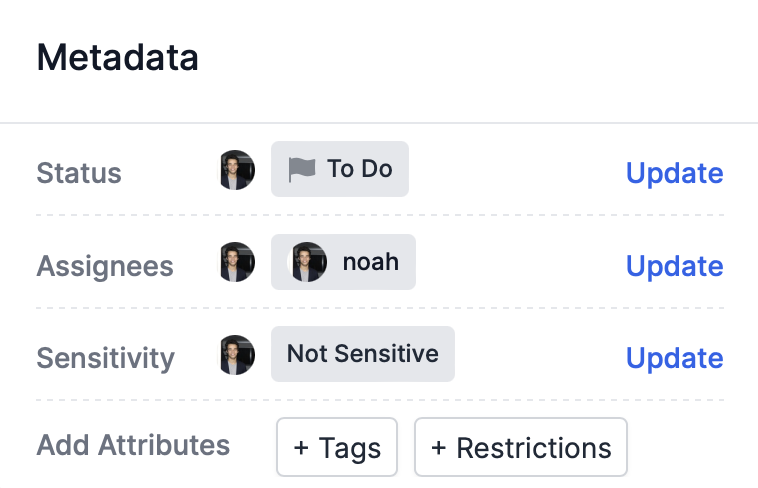

<i>The metadata pane of an incident.</i>

Investigators use metadata to coordinate workflow on Atlos. There are five components to metadata:

## Status 
Status refers to the status of an incident in the investigative workflow. Options include:
- **To Do—** Not actively being worked on. To Do incidents are the best places to start contributing to a project. 
- **In Progress—** Actively being worked on. Check in with the researcher who claimed an incident before contributing. 
- **Help Needed—** Stuck, or ready for a second opinion. Be sure to explain why you’re marking an incident as Help Needed so other researchers know where you need help.
- **Ready for Review—** Ready for a moderator’s verification. This applies to incidents where all applicable attributes have been updated. 
- **Completed—** Investigation complete. A moderator will mark an incident as Completed once they’ve verified an incident’s attributes. Marking an incident as Completed seals the incident’s data so that only project owners and managers can edit it. 
- **Canceled—** Will not be completed (out of scope, duplicate, etc.). A moderator will mark an incident as Canceled if it’s not relevant or if it’s a duplicate of an existing incident. Marking an incident as Completed seals the incident’s data so that only project owners and managers can edit it. 

## Assignees
Assignees are the investigators assigned to an incident. Use assignees to track who is directly responsible for an incident during each phase of the investigation. 

## Sensitivity 
Atlos takes safety seriously. To ensure investigators’ safety, every incident must have a sensitivity value. We use this value to communicate media’s sensitivity to investigators before they view it, because researchers are less likely to be traumatized by graphic content when they know what to expect. If content is graphic, we also display a clickthrough to further prevent inadvertent exposures. 

Sensitivity options include:
- **Not Sensitive—** Nothing is potentially graphic or sensitive in the incident's source material. 
- **Personal Information Visible—** The incident’s source material includes information that could be used to identify individuals. For example, if a video of a potential human rights violation is filmed from a window of an apartment, the video could be used to geolocate the apartment. In repressive states, this can lead to witnesses facing retribution by their government. Publishing or publicizing the source material might pose a danger for the individuals’ safety.
- **Graphic Violence—** The incident’s source material contains potentially distressing material. Viewer discretion is advised.
- **Deleted by Source—** The incident’s source material has been deleted by the source. 
- **Deceptive or Misleading—** The incident’s source material includes information that has been found to be deceptive. The incident might be a deepfake or manufactured evidence of a false flag operation. 

## Tags 
Tags are used for grouping incidents. To add a new tag, type a new label and press **Enter** in the tag search bar. 

Only project owners and managers can add and update tags. 

## Restrictions 
Atlos offers several tools for moderating viewing and editing access to individual incidents. We recommend that you use these incident-level tools only when Atlos' project-level access controls are insufficient. Only project owners and managers can edit an incident's restrictions. 

### Freeze an incident
Freezing an incident prevents viewers and editors from editing a incident's attributes, metadata, and source material. Project managers and owners can still edit a frozen incident's data.


We encourage you not to use this restriction to seal data when an investigation is completed (as a replacement for marking incidents as [Complete](/incidents/metadata/#status)). Use Frozen as an emergency moderation tool in extreme cases, not as a standard part of your workflow.


To freeze an incident, project managers and owners can:
1. Click the **Update** button in the **Restrictions** row of the incident's **Metadata** pane. 
2. Add the Frozen restriction. 
3. Click **Post update**.

### Hide an incident
Hiding an incident prevents viewers and editors from viewing an incident. Hidden incidents will not appear in viewers' and editors' searches, homepages, notifications, or exports. Project managers and owners will still be able to view hidden incidents in their searches, homepages, notifications, and exports. 

To hide an incident, project managers and owners can:
1. Click the **Update** button in the **Restrictions** row of the incident's **Metadata** pane. 
2. Add the Hidden restriction. 
3. Click **Post update**.