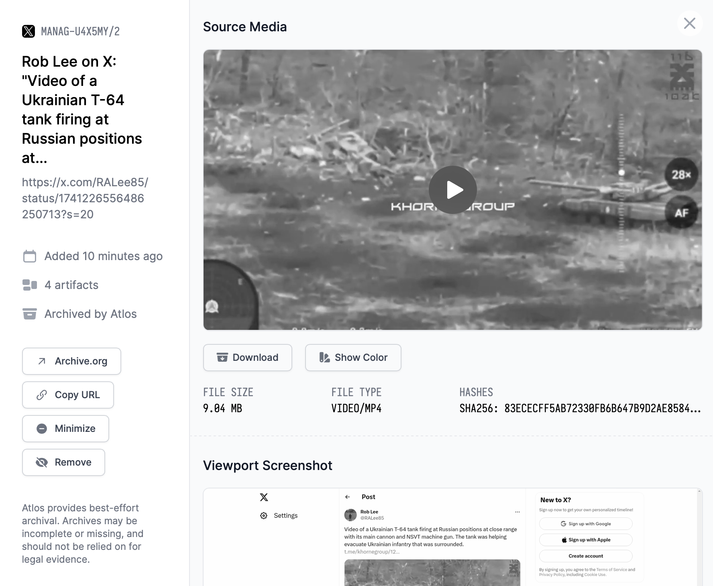

Source material is the evidence depicting an incident. Each incident can have zero, one, or multiple pieces of source material. 

<i>Source material automatically archived on Atlos.</i>

Source material takes two forms on Atlos: file uploads and archived links.

## File uploads
Investigators can easily upload files to Atlos’ source material pane. 

To upload a file: 
1. Click **Add Material** in the **Source Material** pane of the incident page. 
2. Click **Manual Upload**. 
3. Drag and drop your file or click **Upload file** to browse your computer. 
4. If the file originated online, add its source link in the provided field. 
5. Click **Publish to Atlos**. 

The Source Material upload process accepts all files smaller than 250 MB. 

## Automatic archival 
Investigators can also paste a link into Atlos’ automatic archival tool. To archive a link:
1. Click **Add Material** in the **Source Material** pane of the incident page. 
2. Paste your link into the provided field. 
3. Click **Publish to Atlos**. 

### Artifacts 
Atlos’ archival system will attempt to archive the following artifacts:
- **Viewport screenshot—** A screenshot (png) of a browser window opened to the provided link. 
- **Full page screenshot—** A screenshot (png) of the full webpage. 
- **Webpage PDF—** A PDF of the webpage. 
- **Visual media—** Photos and videos embedded in the webpage (a video from a Tweet, for example). 
- **Internet Archive submission—** Atlos will also submit the provided link to the Internet Archive. 
  

Note that Atlos’ automatic archival system is best-effort; Atlos will not always archive every piece of media on a webpage. It is also subject to the whims of social media platforms’ changing software and policies. We think Atlos’ automatic archival tool is a convenient system for quickly preserving sources during a journalistic investigation, but it’s not suitable for forensic or legal evidentiary purposes.


## Deduplication
Deduplication, or the process of finding and eliminating duplicates, can be extremely time-consuming. To accelerate the process, Atlos deduplicates source material in two phases:
- **Link-level deduplication—** When an investigator pastes a link into the automatic archival system or the manual upload option, Atlos will immediately notify the investigator if they’ve added a link that is already in another incident in their project.
- **Pixel-level deduplication—** Atlos also detects duplicate images and videos, even if they’ve been uploaded or archived from two different sources. When it ingests visual media, Atlos takes a perceptual hash—a sort of mathematical fingerprint—of each photo and video. We store these perceptual hashes and reference each new fingerprint against our existing library. When we detect that two incidents in the same project contain the same piece of media, Atlos will ping you with an automated comment. Because the perceptual hashing process isn’t instant, this deduplication warning may occur several minutes after you've uploaded or archived source material. 

## How to merge media
If your project has duplicate incidents that contain different source material, Atlos enables investigators to merge one incident’s source material into another incident. This is preferable to re-archiving links, because links may have broken since the content was originally archived. 

In the merging process, you’ll need to choose which incident you’ll be merging material from (the donor incident) and which incident you’ll be merging material to (the receiving incident). We recommend merging material to the incident with a more robust investigative record—whichever incident contains more attribute data and conversation should become the source of truth. 

To merge media:
1. Navigate to the donor incident. 
2. Click the three dots in the top-right corner of the incident page. 
3. Click **Merge Media**. 
4. Paste in the incident ID of the receiving incident. 
5. Click **Merge**. 
   
Once you’ve verified the media was successfully merged, we recommend changing the Status of the donor incident to Canceled. Atlos will not automatically change the donor incident’s Status. 

## Hide source material
Atlos offers two options for hiding source material that has been added by accident. All investigators can minimize source material, which moves it to a collapsible section of the Source Material pane. Project owners and managers can also remove source material, which makes it visible only to other project owners and managers. 

### Minimize source material 
If you add source material to an incident in error, you can hide the material from view by minimizing it. Atlos won't display minimized source material in the main Source Material pane. It will still be visible under a separate section of the Source Material pane, accessible by clicking the **View minimized media** button.  Minimizing source material impacts its visibility for all members of a project. 

To minimize media on the Source Material pane: 
1. Click the three dots to the right of the piece of source material. 
2. Click **Minimize**. 

If you already have a piece of source material's artifacts window open, just click `Minimize` on the left side of the window. 

### Unminimize source material
If you have minimized source material in error, you can easily restore the material. 

To restore minimized source material:
1. Click **View minimized media**. 
2. Click the three dots to the right of the piece of source material. 
3. Click **Unminimize**. 

If you already have a piece of source material's artifacts window open, just click **Unminimize** on the left side of the window.

### Remove source material 
Project owners and managers can also remove source material. While minimized source material remains accessible (albeit hidden) to all members of a project, source material that has been removed is accessible only to project owners and managers. 

To remove media on the Source Material pane:
1. Click the three dots to the right of the piece of source material.
2. Click **Remove**.

If you already have a piece of source material's artifacts window open, just click **Remove** on the left side of the window.

### Restore removed source material
If you have removed source material in error, you can easily restore the material. 
1. Click **View removed media**. 
2. Click the three dots to the right of the piece of source material.
3. Click **Undo Removal**. 

If you already have a piece of source material's aritifacts window open, just click **Undo Removal** on the left side of the window.


**Why can't I delete source material?**   
To protect the integrity of investigators' data, Atlos makes it impossible to actually remove content from the platform. 
If you think source material in your project is so sensitive that it must be removed from Atlos’ database and that other moderation tools such as Removing the material are insufficient, please contact us at [contact@atlos.org](mailto:contact@atlos.org).
