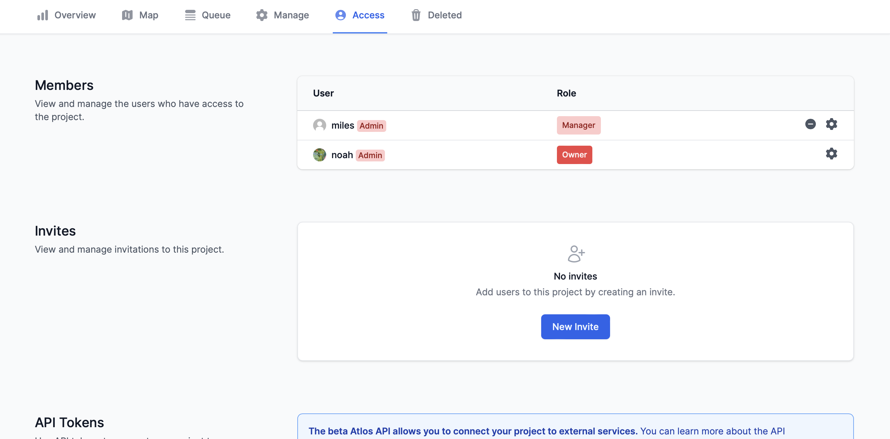

Open source investigations thrive in large investigative communities. We think Atlos shines as a home for this type of large-scale collaboration. 

<i>A project's access page.</i>

## Add a member
To add a member to a project: 
1. Navigate to the **Projects** page.
2. Select the relevant project. 
3. Navigate to the **Access** page, which can only be edited by project owners.
4. In the **Invites** section, click **New invite**. 
5. Configure your invite link's settings and send the link to your collaborators. If they don't have an Atlos account, they'll be prompted to create one before joining your project.

When adding a new member, choose each collaborator’s role carefully. Members’ roles dictate their editing permissions and data access. You can learn more about roles and permissions below.

## Remove a member
To remove a member from a project:
1. Navigate to the **Projects** page.
2. Select the relevant project. 
3. Navigate to the **Access** page, which can only be edited by project owners.
4. Click  &nbsp;next to the member who you'd like to remove.

## Deactivate an invite link
If an invite link to a project has ended up in the wrong hands, it's easy to deactivate it:
1. Navigate to the **Projects** page.
2. Select the relevant project. 
3. Navigate to the **Access** page, which can only be edited by project owners.
4. Under the relevant invite link, click  &nbsp;to deactive the link.

## Change an existing member’s role
To change an existing member's role:
1. Navigate to the **Projects** page.
2. Select the relevant project. 
3. Navigate to the **Access** page.
4. Click  &nbsp;next to the member whose role you want to change. Note that this button is visible only to project owners.
5. Select the member’s new role from the drop-down menu.
6. Click **Save**.

## Roles & permissions
There are four roles on Atlos. We’ve listed them below in order of increasing authority.

### Viewer
Viewer is the most restrictive role on Atlos. Use this role to share data from a completed investigation with outside collaborators. Viewers can:
- View and comment on incidents
- Export a CSV of project data
- View a list of project members

### Editor
Editors are standard contributors to projects. Editors can:
- Do everything viewers can do
- Edit all incidents (except those marked as completed)

### Manager
Managers facilitate investigations on Atlos. Project administrators are often given the Manager role. Managers can:
- Do everything editors can do
- Mark incidents as complete
- Edit all incidents, including those marked as complete
- Delete incidents and view deleted incidents
- Change a project’s attributes 
- Change a project’s title, description, and identification code
- Bulk import data
- Bulk export all project data, including underlying media, updates, and metadata

### Owner
Owners are like managers, but they can also add and remove members and change their permissions. Owners can:
- Do everything managers can do
- Add and remove members 
- Change members' roles
- Create API tokens


**Follow a minimum access policy to protect your investigation.**                
A minimum access policy restricts each researcher to the lowest level of access they need to perform their work. 
That means an investigator joining a project only so that they can view data should be granted a Viewer role, not a role that gives them edit access.
