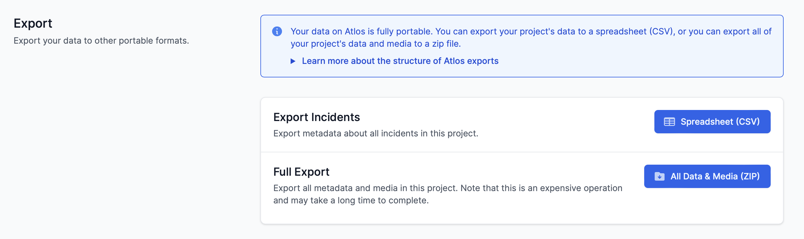
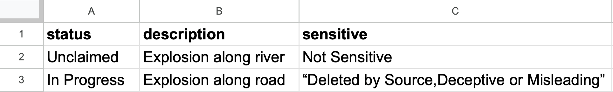
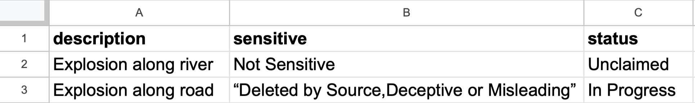

Data on Atlos is easily portable. Our goal is to support your investigations wherever they might go, not to lock you in.

<i>It's easy to export data from Atlos.</i>

## Data import
Researchers that have accumulated a large amount of data before beginning working on Atlos can import their data into Atlos. However, we recommend keeping your investigation on Atlos whenever possible. Our change-tracking and archival systems can’t be used on data that’s not yet in Atlos—the faster data is added to the platform, the faster we can assure its integrity. 

### How to import data
To import data:
1. Navigate to the **Projects** page.
2. Select the relevant project. 
3. Navigate to the **Manage** page and scroll to the **Bulk import** section at the bottom of the page. 
4. Click **Upload a file**. 
5. Click **Publish to Atlos** once Atlos has processed your CSV. 

See the [formatting](/investigations/import-and-export-data/#formatting-for-bulk-import) section below for a full explanation of acceptable CSV formats. Note that bulk import is accessible only to project owners and managers. 

### What is a CSV? 
Atlos uses CSVs to make the platform compatible with all spreadsheet software. CSVs standardize spreadsheet data as values separated by commas. 

For reference, we’ve included a spreadsheet and CSV representing the same data: 

_Spreadsheet_

_CSV_ \
status,description,sensitive \
Unclaimed,Incident along river,Not Sensitive \
In Progress,Incident along road,"Deleted by Source,Deceptive or Misleading" 

### Recommended workflow
To transfer your data from a spreadsheet to Atlos, we recommend you:
1. Edit your data in a spreadsheet (Google Sheets or Microsoft Excel both work) to ensure its compatible with Atlos' bulk import system.
2. Export your spreadsheet as a CSV.
3. Import that CSV into Atlos. 

### Formatting for bulk import
Atlos requires a specific formatting for CSVs to ensure we parse your data a correctly. 

**Required columns—** Atlos requires three columns in all bulk imports. Spreadsheets must include three titles in the first row:
* status
* description
* sensitive

**Order—** The order of these column headers is not relevant; Atlos will not treat the following tables differently:

**Case sensitivity—** Bulk import is sensitive to the capitalization of column names. Bulk import of a spreadsheet with the sensitivity column titled “Sensitive” will fail because the title is capitalized. 

**Optional columns—** It’s possible to import more data than just status, description, and sensitivity. The full list of allowed columns is dependent on each project’s list of attributes. Instead of providing comprehensive documentation of permissible columns here, we provide it in the in-platform documentation on the Bulk Import section of the Manage page. 

## Data export
We think Atlos is a great tool for collaboration at scale, but it's not the best tool for every job. Whether investigators are looking to archive media forensically, publish data, or just take another look in a Google Sheet, sometimes it’s necessary to export data. Atlos offers two types of data exports:
- **CSV export—** Anyone on Atlos can export the results of any search to a CSV.
- **Full project export—** Project owners and managers can export all project data, including media, changelogs of each incidents, and more. 

### Export data to a CSV
To export all of a project’s data:
1. Navigate to **Projects** page.
2. Navigate to the **Manage** page of the project whose data you wish to export. 
3. In the **Export** section, click **Spreadsheet (CSV)**. 

To export the results of any search to a CSV, click  &nbsp;in the search bar. 

### Export all project data
Not all of a project's data is captured in a CSV. To export all project data—including media, metadata, the project's data model, and updates to each incident:
1. Navigate to **Projects** page.
2. Navigate to the **Manage** page of the project whose data you wish to export. 
3. In the **Export** section, click **All Data and Media (ZIP)**. 

Note that full exports are slow, may be gigabytes in size, and are expensive for us to run. We recommend you only begin a full export when absolutely necessary.
