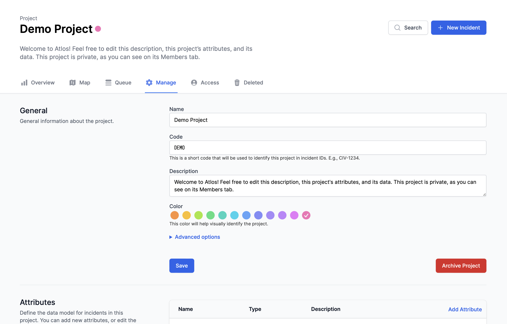

Projects are the unit of investigations on Atlos. They’re also the level at which investigators can: 
- **Collaborate—** Project owners can easily invite other investigators to collaborate on their projects. Data on Atlos is shareable only at the project level; individual incidents cannot be shared. 
- **Customize attributes—** Investigators can easily change a project’s attributes to better suit their research. Attributes are customizable only at the project level; all incidents in a project have the same data model.

<i>A project's manage page.</i>

## Create a new project 
1. Navigate to the Projects tab.
2. On the top-right corner, click **New Project**. 
3. Enter a name, description, and code for the project. 
4. Click **Save**.

### Description 
Project descriptions provide space for additional details about a project. For example, investigators might include links to published reports that use project data in the description. 

### Project code
Every incident on Atlos has a unique ID. Incident IDs include both a project code and a unique six-character incident identifier. For example, an investigator might choose the project code DAM for a project focusing on the aftermath of the destruction of the Kakhovka Dam. An incident with an ID of DAM-123456 would clearly belong to the Kakhovka Dam investigation. 

## Edit project data
To edit your existing project's data, navigate to its Manage pane. Project owners and managers can change projects’ names, codes, and descriptions at any time, but we recommend settling on descriptive information at the beginning of an investigation to avoid confusing collaborators. 

Read [here](/incidents/attributes/#how-to-customize-attributes) for more information on customizing a project's attributes. 

## Duplicate or copy an incident to another project 
To duplicate an incident or to copy an incident to a second project:
1. Navigate to the incident to be copied.
2. Click the three vertical dots on the top-right corner of the incident page.
3. Click the **Copy to Project** button.
4. Select the project you want the incident to be copied to. Select the incident's own project to duplicate it.
5. Click **Copy**.

## Copy many incidents to a project
To copy many incidents in bulk:
1. Navigate to **table view**.
2. Hover over the profile photo to the left of an incident you'd like to copy.
3. Click the checkbox.
4. Repeat steps 2-3 for each incident.
5. Click **Copy**.