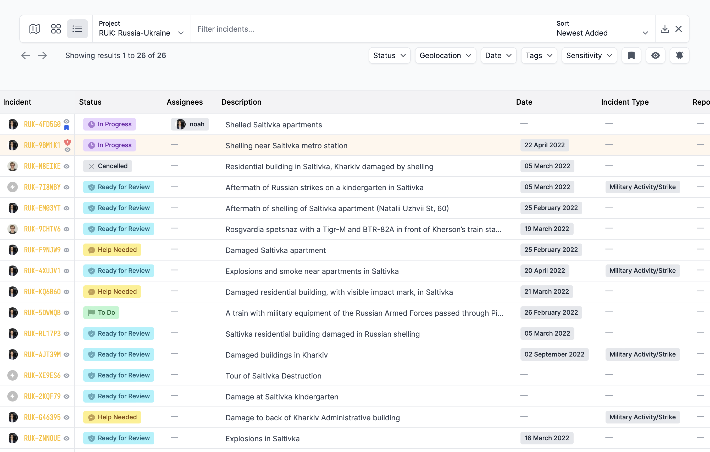

Atlos provides many options to slice and dice your data—you can view your catalog on a map, in cards, or in a table. It’s also easy to sort, search, and filter incidents. Navigate to the Incidents page to view your catalog. 

<i>The table view for a project.
</i>

## Sorting data
There are five ways to sort incidents on Atlos. The platform remembers your choice of sorting the next time you navigate to the Incidents page. 
- **Newest Added** shows the incident most recently added first. 
- **Oldest Added** shows the incident least recently added first.
- **Recently Modified** shows the incident whose data has been most recently updated first.
- **Least Recently Modified** shows the reverse order of Recently Modified, showing the incident whose data has been altered least recently first. 
- **Description (A-Z)** puts the incidents into an alphabetical order, showing first the incident whose description starts with an A.
- **Description (Z-A)** puts the incidents into reverse alphabetical order, showing first the incident whose description starts with an Z.

## Data views
There are three ways to view incidents on Atlos. 

### Map view
The map view shows search results on a global map. Note that the map view may be incomplete because it only shows geolocated incidents. 

### Card view
Card view displays incident cards with the following data: 
- Source material thumbnail
- Status
- Date 
- Sensitivity
- If the incident has geolocation data, Atlos will display a geolocated label on the card
- The profile images of investigators who have contributed to the incident
  
### Table view
Table view is Atlos’ spreadsheet-like visualization tool. Table view displays attribute data of many incidents in a single table, enabling investigators to view many incidents’ data at a glance.  In table view, clicking on an attribute will open up a pop-up editing window so investigators can update data directly from the Incidents page. To open an incident, click on its code. Because every project has a different schema, when viewing incidents in table view, you'll need to first choose a project.

#### Bulk editing
In table view, click on the profile image next to any incident to open up the bulk selection tool. Then select as many incidents as you’d like to edit their statuses or tags in bulk. 

## Filtering data
There are five filters available on Atlos. You can use multiple filters at the same time. 
- **Status—** Filter by all incidents of a given Status (Unclaimed, Ready for Review, etc.)
- **Geolocation—** Filter to find all incidents of a project that are in a certain radius of a location.
- **Date—** Filter to find all incidents of a project whose date is set within a certain time period. The filter refers to the date set within the Date attribute, not the date when the incident was added to Atlos.
- **Tags—** Find all incidents of a project that have a certain tag or that don’t have a tag at all. Tags are used to coordinate projects and sort data. Project owners can create new tags as needed.
- **Sensitivity—** Find all incidents of a project that have a certain Sensitivity value.

## The queue
The queue is a project-level view that organizes incidents by status. Use it to quickly find a new incident to investigate. 

To find the queue:
1. Navigate to the **Projects** page. 
2. Select the relevant project. 
3. Then click on the **Queue** pane. 
