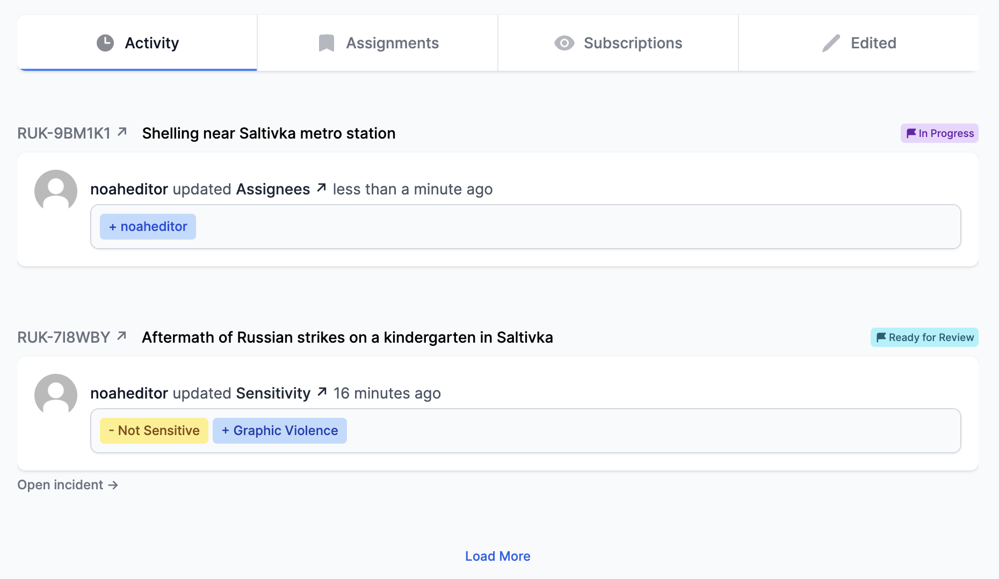

<i>An investigator's profile page.</i>

## Profile 
Your profile is visible to all Atlos users. It includes:
- Your username
- Your profile photo
- Your bio
- A list of the projects of which you’re a member
- A feed of your recent updates
- A list of the incidents to which you're assigned
- A list of the incidents to which you've subscribed
- A list of the incidents you've recently edited

Note that investigators on Atlos will only be able to see updates and projects on your profile that they would otherwise have access to—if someone is not a member of a project, they won’t see your update to an incident in that project just because they navigated to your profile page. 

### Edit your profile 
To edit your bio or profile image:
1. Navigate to the **Account** page by clicking **Account** on the left sidebar menu. 
2. Edit your bio.
3. Press **Save** after making changes to your profile. 

To edit your username or email address, please email the Atlos team at contact@atlos.org. 

## Password reset
### Change password
To change your password: 
1. Navigate to the **Account page** by clicking **Account** on the left sidebar menu. 
2. Click the **Change password** button on the **Account and Security** pane. 
   
Note that your current password is necessary to change your password; if you’ve forgotten your password and are attempting to change it while logged in, log out and complete the password reset process below.

### Forgotten password
If you have forgotten your password:
1. Click **Reset password** on the login page. 
2. Enter your email address. 
3. Complete the captcha. 
4. Click **Send instructions**.
5. Follow the instructions you receive in your inbox. 

## Multi-factor authentication (MFA)
### Enable MFA
We implore all users enable multi-factor authentication (MFA) for their Atlos account. To enable MFA: 
1. Navigate to the **Account** page by clicking **Account** on the left sidebar menu.
2. Click the **Multi-factor auth** button on the **Account and Security** pane.

### Generate backup codes
We encourage you to generate and save single-use backup MFA codes in case you lose access to your MFA device. To generate backup codes:
1. Navigate to the **Account** page by clicking **Account** on the left sidebar menu.
2. Click the **Multi-factor auth** button on the **Account and Security** pane.
3. Enter your current MFA code and click **Continue**.
4. Click **Get Backup Codes**.
5. Click **Download** to store your backup codes. 

### Regenerate backup codes
If you have run out of backup codes or lost access to your codes, or someone you don't trust has access to your backup codes, you should regenerate new backup codes. Your old codes will no longer work after you have regenerated new backup codes. To regenerate new codes:
1. Navigate to the **Account** page by clicking **Account** on the left sidebar menu.
2. Click the **Multi-factor auth** button on the **Account and Security** pane.
3. Enter your current MFA code and click **Continue**.
4. Click **Regenerate Codes**.
5. Click **Download** to store your new backup codes. 
   
### Delete backup codes 
If someone you don't trust has access to your backup codes and you don't want to generate new codes, you can delete your existing codes instead. To delete backup codes:
1. Navigate to the **Account** page by clicking **Account** on the left sidebar menu.
2. Click the **Multi-factor auth** button on the **Account and Security** pane.
3. Enter your current MFA code and click **Continue**.
4. Click **Delete All Codes**.