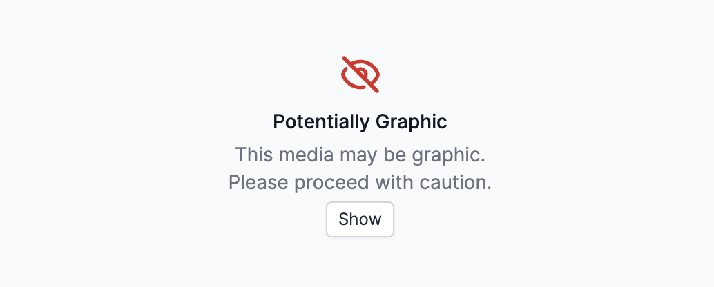

<i>A graphic violence warning on Atlos.</i>

Viewing media depicting graphic violence puts researchers at risk of vicarious trauma. While Atlos takes several steps to protect researchers, no technical solution is comprehensive. If you’re struggling with your mental health, seek out professional help and consider taking a break from open source research.

## What you can do
To familiarize yourself with tactics for preventing and coping with vicarious trauma, we reccomend reading: 
- ["Open Source Investigations: How to Prevent, Address and Identify Vicarious Trauma"](https://gijn.org/2019/02/05/open-source-investigations-how-to-prevent-address-and-identify-vicarious-trauma/) by Hannah Ellis
- ["Handling Traumatic Imagery: Developing a Standard Operating Procedure"](https://dartcenter.org/resources/handling-traumatic-imagery-developing-standard-operating-procedure) by Gavin Rees 
- ["How to Maintain Mental Hygiene as an Open Source Researcher"](https://www.bellingcat.com/resources/2022/11/23/how-to-maintain-mental-hygiene-as-an-open-source-researcher/) by Giancarlo Fiorella

## What we do
Atlos implements several industry best practices by default:
- Atlos mutes all videos by default, because researchers [find](http://eyewitnessmediahub.com/research/vicarious-trauma/findings/what-makes-eyewitness-media-traumatic-) that the audio of graphic media is often more disturbing than the video.
- Atlos makes all media grayscale by default, because black-and-white photos and videos have a [smaller](https://ojs.aaai.org/index.php/HCOMP/article/view/5270/5122) psychological impact than color media.
- Atlos helps reduce surprise exposures with a “Graphic Violence” warning when investigators have marked source material as graphic, because media can be [especially impactful](http://eyewitnessmediahub.com/research/vicarious-trauma/findings/what-makes-eyewitness-media-traumatic-) when researchers aren’t expecting to be exposed to something disturbing.
- Atlos doesn’t display thumbnails or previews for media marked as graphic, so researchers must choose to view graphic content. 