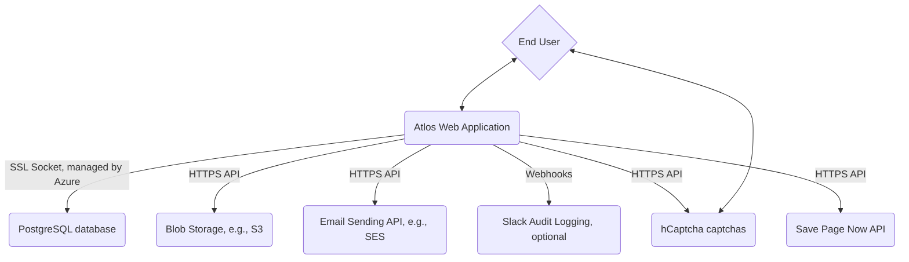

# Atlos Platform

This folder contains the primary source code for the Atlos platform. It's a standard Phoenix application written in Elixir. There should be (relatively) few surprises if you're accustomed to working on Phoenix applications. We have 200+ automated tests to help you catch logic errors quickly.

This document contains information about:

* [Setting up a local development environment](#local-development-guide)
* [Understanding the high-level architecture of the Atlos platform](#architecture-overview)
* [Understanding the software architecture of the Atlos platform](#software-architecture)
* [Self-hosting Atlos on your own infrastructure](#self-hosting)
* [Contributing to Atlos](#contributing)
* [Atlos' license (open source GPLv3)](#license)


## Local Development Guide

To set Atlos up for local development, you need not do much. Just click the green "Code" button at the homepage of our repository (https://github.com/atlosdotorg/atlos), and then navigate to Codespaces. Then click "Create new codespace on main". And then you're all set!

Once the Codespace opens up in your VS Code window, you'll be able to start the Phoenix server by `cd`'ing into `platform`, and then running `mix phx.server`. VS Code should detect that the server is running on port `3000` and offer to forward that port to your local machine. (If not, just add the port under `Ports` in the VS Code bottom menu.)

You can log into an admin using the following credentials:

- Email: `admin@localhost`
- Password: `localhost123`

And you can log into a regular user account using the following credentials:

- Email: `user@localhost`
- Password: `localhost123`

Other tasks you might want to perform from inside the `platform` subdirectory (i.e., this one):

- Install dependencies with `mix deps.get` (note: not necessary if you're using a dev container, since dependencies will be installed automatically)
- Create and migrate your database with `mix ecto.setup` (note: not necessary if you're using a dev container, but helpful if you want to refresh the environment)
- Start Phoenix endpoint with `mix phx.server` or inside IEx with `iex -S mix phx.server`
- Run our 200+ automated tests with `mix test`.

For more information about contributing, see the [Contributing](#contributing) section below.

## Architecture Overview

Atlos is intentionally simple. Our infrastructure consists of only a few parts:

* The Phoenix web server
* A PostgreSQL database
* Some kind of object storage (e.g., Amazon AWS)
* Some kind of way to send emails (e.g., Amazon SES)
* A few miscellaneous (and optional!) APIs that we can hook into (Slack for audit logging, hCaptcha for captchas, the Internet Archive's Save Page Now API)

There is no Redis server (Elixir obviates that); there is no background processing job worker (Elixir obviates that); there is no Kubernetes (Azure Container Apps/Fly.io obviate that).

Here's a high-level architecture diagram that illustrates how the pieces connect together:



If you're familiar with Atlos, you know that archival is a big part of what we do. But notice that there is no archiver component to the diagram above! That's because archival is directly integrated into the Atlos web application itself. We archive from the very same set of instances from which we serve user requests. This design simplicity helps us avoid difficult-to-deploy (and expensive!) cloud infrastructure.

### Where is this deployed?

Right now, we deploy Atlos in two places: on the lovely Fly.io (who sponsor us — thank you!) and on Microsoft Azure (who also sponsor us — thank you!).

We are in the middle of a transition of our infrastructure from Fly.io to Azure. While the Fly.io platform is great, right now we need a more robust and battle-tested environment to run our application (and especially our database), and we ran into enough issues with Fly.io that we decided to make the leap to Azure.

On Azure, we use only three products directly: Azure Container Apps, Azure Database for PostgreSQL, and Azure Container Registry. The Atlos web app runs inside Azure Container Apps; you can see the full CI deploy script inside [/.github/workflows/deploy-staging-azure.yml](/.github/workflows/deploy-staging-azure.yml). Atlos is entirely containerized, and our containers are stored inside Azure Container Registry. As you might expect, we use Azure Database for PostgreSQL for our database. (It helpfully gives us robust backups, point-in-time restores, etc.)

### Environment Variables

The Atlos web application will read the following environment variables. Some are absolutely required in production, while others are optional.

- `S3_BUCKET` — the primary S3 bucket to use for content
- `AWS_REGION` — the AWS region for S3
- `AWS_MAILER_REGION` — the AWS region for mail
- `AWS_ACCESS_KEY_ID` — the AWS access key id
- `AWS_SECRET_ACCESS_KEY` — the AWS access secret
- `APPSIGNAL_PUSH_KEY` — the AppSignal push key (optional)
- `APPSIGNAL_APP_ENV` — `dev`, `staging`, or `prod` (how we disambiguate environments in AppSignal) (optional)
- `SLACK_AUDITING_WEBHOOK` — Slack webhook for audit events (optional)
- `HCAPTCHA_SITE_KEY` — hCaptcha site key
- `HCAPTCHA_SECRET` — hCaptcha secret
- `ENABLE_CAPTCHAS` — captchas are _checked_ if `true` (default false for development; set to `true` in production!)
- `INSTANCE_NAME` — user-facing instance name (appears in footer and below logo; not shown if empty) (optional)
- `SPN_ARCHIVE_API_KEY` — API key for the Internet Archive [SPN API](https://docs.google.com/document/d/1Nsv52MvSjbLb2PCpHlat0gkzw0EvtSgpKHu4mk0MnrA/edit#) (if provided, Atlos will give project owners the _option_ to submit all added links to the Internet Archive for persistent archival; key expected in the form `myaccesskey:mysecret`) (optional)
- `COMMUNITY_DISCORD_LINK` — link to the community Discord server (shown in onboarding and in Settings) (optional)
- `ATTRIBUTE_OPTIONS` — JSON object of attribute options; e.g., `{"type": ["Civilian Harm"], "impact": ["Structure", "Structure/Residential"], "equipment": ["Small Arm", "Munition"]}` (optional, and typically not needed)
- `AUTOTAG_USER_INCIDENTS` — JSON object of tags to apply to incidents created by non-privileged users; e.g., `["Volunteer"]` (optional, and typically not needed)
- `DEVELOPMENT_MODE` — set to `true` if Atlos should run in development mode (e.g., `TESTING` becomes a valid invite code) (optional, recommended ONLY on staging/locally)
- `HIGHLIGHT_CODE` — Code for [Highlight](https://highlight.run) analytics and monitoring (optional)
- `RESTRICT_PROJECT_CREATION` — whether to restrict project creation to privileged users only (to enable, set to `true`) (optional, default off)
- `ONBOARDING_PROJECT_ID` — the ID of the demo onboarding project template; if unset, the onboarding project will not be created (optional but recommended)
- `COOKIE_SIGNING_SALT` — salt to use for cookie signing (must be at least 64 bytes)
- `SECRET_KEY_BASE` — base secret key for Phoenix (must be at least 64 bytes)

### A special note on the database

Atlos requires two very-standard Postgres extensions to operate: `citext` (for case-insensitive text fields) and `postgis` (for geospatial storage and querying). The Atlos platform's built-in migrations _should_ add these extensions for you, provided the Atlos user in Postgres has sufficient permissions to create database extensions.

When running on Azure's database, the Atlos user _does not_ have sufficient permissions to create database extensions, so when deploying for the very first time in a new database, you'll need to manually run the following SQL statements as an admin on the database that Atlos will use:

```sql
CREATE EXTENSION IF NOT EXISTS citext;
CREATE EXTENSION IF NOT EXISTS postgis;
```

## Software Architecture

The architecture overview above gives you a picture of how Atlos runs at a macro level, but how is the code put together?

Like a typical Phoenix application, our platform has two main parts: `platform` and `platform_web`. `platform` contains the core business logic of Atlos (schemas for the database, internal APIs for interacting with the database, archival, etc.) while `platform_web` contains the logic for rendering and managing web pages, our public API, etc. `platform_web` sits on top of `platform`.

Rather than creating a separate architecture diagram for our internal platform, you're better off just navigating the code. We follow standard conventions for Phoenix/Elixir project layouts, so doing so should be fairly straightforward.

Some important notes regarding the codebase and naming:

* "Incidents" are called "media" internally, and are part of the `material` context
* "Source material" is called "media versions" internally, and are part of the `material` context

And some best practices that we try to maintain:

* All critical or data-changing actions should be performed via a context function
* All critical or data-changing actions should be logged using the audit logging system we have in place (see `Platform.Auditor`)
* All tests should pass on mainline (we use GitHub Actions to automate testing and deployment)
* All code should be formatted using `mix format`
* We use Oban for background jobs; these jobs are defined in `Platform.Workers`

### Archival

Automatic archival is one part of Atlos that looks slightly different from the rest. Our archival system is a standalone Python script that the Elixir-native archival module (`Platform.Workers.Archiver`) calls in a subprocess.

Archival is hard, and we want to minimize the amount of surface area that we are responsible for maintaining. Therefore, we "outsource" much of our archival logic to Selenium and to Bellingcat's [auto-archiver](https://github.com/bellingcat/auto-archiver).

You can read the code for the Atlos archival script at [/platform/utils/archive.py](/platform/utils/archive.py). It's straightforward, and it's fairly well-commented.

### Attributes

One core part of Atlos is the idea of an "attribute." In Atlos, an attribute is a piece of metadata that can be applied to an incident. For example, an attribute might be "type" and the value might be "Civilian Harm."

Attributes exist in two places: on incidents and on projects. Projects define the schema of the attributes, and incidents store values for those attributes. Some attributes are built-in to Atlos, like `description` and `status`; these aren't customizable on a per-project basis. Other attributes are project-specific, like `type` and `impact`, and are defined by the project owner. (We provide sensible default attributes, but they can be changed.)

Attributes are stored in the database in two ways. Values of built-in attributes are simply columns in the `media` schema (recall that internally, "incidents" are called "media"), and their schema is essentially hard-coded into Atlos (though they are simple to change; see [attribute.ex](/platform/lib/platform/material/attribute.ex)).  Project-specific attributes are stored as an Ecto `embeds_many` inside [`project.ex`](/platform/lib/platform/projects/project.ex). The values of these custom attributes are stored inside the `media` schema as a JSONB column called `project_attributes`; to Ecto, this is also an `embeds_many`:

```elixir
@primary_key {:id, :binary_id, autogenerate: false}
    embeds_many :project_attributes, ProjectAttributeValue, on_replace: :raise do
    belongs_to(:project, Projects.Project, type: :binary_id)
    field(:value, Platform.FlexibleJSONType, default: nil)
    # ...
end
```

The `value` of a custom attribute is a JSON object representing the value.

How we handle custom attributes is by-far the most complex part of Atlos. (After all, we're trying to fit custom, arbitrary data into a relational database.) If you're interested in learning more, you can read the code in [`project.ex`](/platform/lib/platform/projects/project.ex), [`material.ex`](/platform/lib/platform/material.ex), and [`attribute.ex`](/platform/lib/platform/material/attribute.ex).

### Deployment

Atlos is deployed using GitHub Actions. We have two main workflows: one for testing and one for deployment. The deployment workflow is triggered whenever a commit is pushed to the `main` branch, and it deploys to our `staging` environment in Azure.

Our production environment reads from the `deployments/main` branch. A GitHub action automatically maintains an open pull request from `main` into `deployments/main`. When we want to deploy to production, we merge the pull request.

Note that we currently also run a single-tenant Atlos instance for Bellingcat. This instance is deployed from the `deployments/gap` branch, and is deployed via its own pull request. We typically deploy to main before we deploy to gap, but this is not a hard requirement. This dedicated instance will be retired soon and we will move to a single unified instance for all tenants.

Atlos is meant to be run as a clustered web app with at least two instances. We use Elixir's `libcluster` to cluster our instances together. We use Azure's load balancer to distribute traffic between the instances. Note that clustering is _absolutely required_ for Atlos to run correctly; this clustering is how we run background jobs, real-time syncing, etc.

There is no one-size-fits-all approach to setting up a new Atlos environment; the steps will differ depending on your cloud provider. However, the general steps are:

1. Create a new database
2. Deploy the Atlos web application (via its container image) to a server, setting all necessary environment variables
3. Ensure that each Atlos instance is clustered together
4. Ensure that the Atlos instances can communicate with the database

That's it! You should now have a working Atlos instance. (Again: our infrastructure is intentionally quite simple. If you get stuck, feel free to reach out to us on Discord.)

#### Azure Deployment

Our deployment on Azure — described via the Terraform files in `deployments/` — has the following components:

* A PostgreSQL database (per deployment, via Azure Database for PostgreSQL)
* A container app (per deployment, via Azure Container Apps)

We still store media in AWS S3 (via the `S3_BUCKET` environment variable), and we still send emails via AWS SES (via the `AWS_MAILER_REGION`, `AWS_ACCESS_KEY_ID`, and `AWS_SECRET_ACCESS_KEY` environment variables).

### Testing

Atlos' testing story has two parts: automated tests and manual pre-deploy tests.

Atlos has hundreds of automated tests. They aren't fool-proof — bugs can certainly slip by — but they will catch many logic and security errors. (We've put particular effort into designing tests that will catch security errors; e.g., users trying to edit data that they should not have corresponding access to). You can run these tests by running `mix test`.

But automated tests certainly won't catch everything (and especially not UI bugs). They're not a substitute for manual testing. We have a manual testing checklist that we run through when deploying a release with a lot of "deep" changes.

### Updating Dependencies

There are four "sets" of dependencies that we need to be mindful of periodically updating:

1. **Elixir, Erlang, and Debian:** We use the latest Debian image as our base image. We also use the latest Elixir and Erlang versions. You should periodically update these versions to the latest stable versions. This is a simple process: just update the version numbers in the `Dockerfile`. Be sure to make a corresponding change to the Codespaces configuration file, too.
2. **Elixir libraries:** We use the latest stable versions of all Elixir libraries. You can update these by running `mix deps.update --all`. (Note that this will update all dependencies, including `phoenix` and `ecto`.) Some dependencies may require additional changes to the codebase; e.g., if a dependency changes its API, you may need to update your code to match. You can run `mix hex.outdated` to see which dependencies have newer versions available.
3. **JavaScript libraries:** We use the latest stable versions of all JavaScript libraries. You can update these by running `npm upgrade` inside `/platform/assets` and `/landing`. You can see which dependencies have newer versions available by running `npm outdated`.
4. **Python libraries:** We use the latest stable versions of all Python libraries. You can update these by running `poetry update` inside `platform/utils`. Some dependencies may require additional changes to the codebase; e.g., if a dependency changes its API, you may need to update your code to match. You can run `poetry show --outdated` to see which dependencies have newer versions available.

## Self Hosting

Atlos is open source, and you are welcome to self-host it on your own infrastructure. Self-hosting is a great option for larger organizations that have dedicated, experienced technical teams that can help maintain the infrastructure. While we work hard to keep Atlos simple, self-hosting the platform does require significant technical expertise. We generally only recommend self-hosting Atlos for organizations with:

* A dedicated technical team who can manage the infrastructure
* Special data security or governance requirements that prevent the use of our hosted platform

While anyone is welcome to self-host, we recommend _against_ self-hosting for most organizations. (We also discourage self-hosting for organizations that do so principally to save on the costs of using our hosted version; the cost of managing and purchasing/renting your own servers to run Atlos robustly is almost certainly going to be more expensive than our hosted version.) Our hosted version is designed to be secure, reliable, and easy to use, and we recommend that most organizations use it.

For organizations that do self-host, we encourage you to follow roughly the same deployment steps that we use for our hosted version, though you will have to adapt those steps to your own infrastructure. (See the [Deployment](#deployment) section above for more information.)

At a high level, here are the infrastructure components you'll need:

* A PostgreSQL database
* Some way to run a containerized web application on the internet (e.g., Azure Container Apps, Fly.io, Heroku, etc.)
* S3-compatible object storage for media (e.g., Amazon AWS)

We are also able to provide official and priority support channels to self-hosting organizations that contribute financially to the project. For all organizations, we are happy to answer questions and provide guidance on our Discord server to the extent that we are able.

If you have any questions about self-hosting, please feel free to reach out to us on Discord or via email (contact@atlos.org).

## Contributing

We welcome contributions to Atlos! If you're interested in contributing, please feel free to reach out to us via our Discord server. We're happy to help you get started.

Please be careful to follow our [code of conduct](/CODE_OF_CONDUCT.md) in all interactions with the project.

Some additional tips:

1. Run `mix format` to ensure that your code is formatted correctly.
2. Run `mix credo` to ensure that your code is idiomatic.
3. Run `mix test` to ensure that your code passes all tests.

## License

Atlos is licensed under the GNU GPLv3 license. This is a copyleft license — beware! See [LICENSE.md](/LICENSE.md) for more information.
